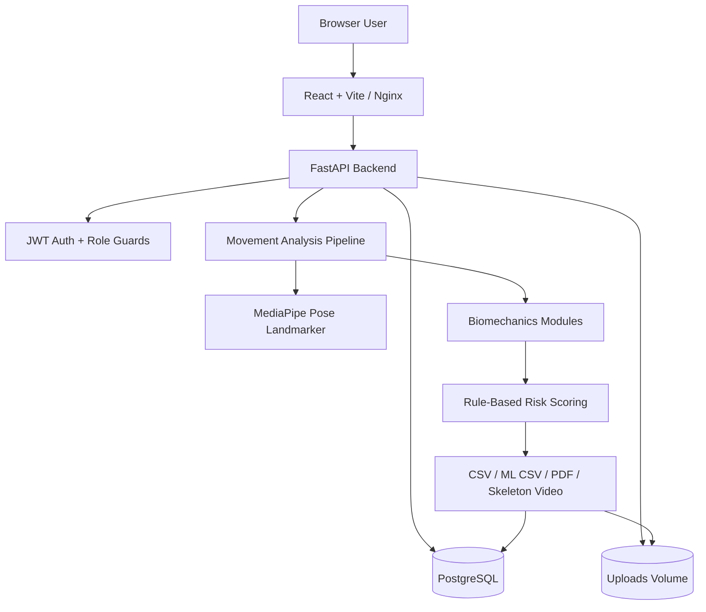

# Sports Injury Risk Detection System
## Complete Technical Documentation

### 1. Project Overview

Sports Injury Risk Detection is a full-stack web application for video-based biomechanical movement analysis, injury-risk scoring, professional athlete support, and role-based sports performance collaboration.

The system allows athletes to upload sports movement videos, process them through a MediaPipe/OpenCV biomechanics pipeline, calculate transparent rule-based risk scores, generate CSV/PDF reports, and share progress with verified coaches, physiotherapists, sports scientists, and administrators.

The current application is designed around a simple priority:

> Preserve working application behavior, then make it reproducible, Docker-ready, and GitHub-ready.

### 2. Technology Stack

| Layer | Technology |
|---|---|
| Frontend | React 18, Vite, React Router, Lucide React, CSS modules by page/domain |
| Backend | FastAPI, SQLAlchemy, Pydantic, Uvicorn |
| Database | PostgreSQL, SQL schema, migration SQL files |
| Authentication | JWT bearer tokens, bcrypt password hashing, optional Google OAuth |
| Video / CV | OpenCV, MediaPipe Pose Landmarker, NumPy |
| Reports | ReportLab PDF generation, CSV exports, ML dataset generation |
| Deployment | Docker, Docker Compose, Nginx frontend container |
| Storage | Local/container volume storage for uploads, skeleton videos, generated reports |

### 3. Repository Structure

```text
sports-injury-risk-detection/
  backend/
    app/
      dependencies/        # Auth and professional access guards
      models/              # SQLAlchemy models
      routes/              # FastAPI routers
      schemas/             # Pydantic schemas
      services/            # Analysis, scoring, notifications, reports
      utils/               # Security helpers
    models/                # MediaPipe model file
    requirements.txt
    Dockerfile
  frontend/
    public/                # Logo/favicon assets
    src/
      components/          # UI, route guards, dashboards, notifications
      context/             # App state, theme, upload state
      layouts/             # Athlete/admin/professional layouts
      pages/               # Role-specific pages
      services/api.js      # API client
      styles/              # Domain/page stylesheets
      utils/               # Auth session, logout, role routes
    package.json
    package-lock.json
    Dockerfile
    nginx.conf
  database/
    schema.sql
    migrations/
  docs/
  docker-compose.yml
```

### 4. Runtime Architecture



### 5. User Roles and Access Model

| Role | Purpose |
|---|---|
| Athlete | Upload videos, maintain profile/injury history, view analyses, receive tasks and rehabilitation work |
| Coach | Discover/connect with athletes, review videos/analyses, assign tasks and recommendations |
| Physiotherapist | Connect with athletes, manage rehabilitation plans/activities, write notes, view movement analytics |
| Sports Scientist | Review connected athletes, team analytics, injury insights, comparisons, research reports |
| Administrator | Approve professional role requests, manage users, analytics, system health, reports |

Important authorization rules:

- New registered users begin as athletes.
- Professional access is not granted by frontend role selection alone.
- Professional access requires a request and admin approval.
- Backend role guards independently protect role-specific APIs.
- Verified professional route guards protect role dashboards on the frontend.

### 6. Frontend Routes

Current frontend routing is defined in `frontend/src/App.jsx`.

#### Public and shared routes

| Route | Component |
|---|---|
| `/` | Landing |
| `/login` | Login |
| `/register` | Register |
| `/notifications` | Notifications |
| `/settings` | Athlete settings |

#### Athlete routes

| Route | Component |
|---|---|
| `/dashboard` | Athlete dashboard |
| `/athlete-profile` | Athlete profile and injury history |
| `/video-upload` | Video upload |
| `/my-videos` | Athlete video vault |
| `/analysis/:videoId` | Analysis workspace |
| `/analysis-history` | Historical analyses |
| `/my-work` | Coach tasks and professional work |
| `/my-rehabilitation` | Rehabilitation plans/activities |
| `/request-professional-role` | Professional role status/selection |
| `/request-professional-role/coach` | Coach application |
| `/request-professional-role/physiotherapist` | Physiotherapist application |
| `/request-professional-role/sports-scientist` | Sports scientist application |

#### Coach routes

| Route | Component |
|---|---|
| `/coach/dashboard` | Coach dashboard |
| `/coach/athletes` | Connected athletes |
| `/coach/athletes/:athleteId` | Athlete detail |
| `/coach/athletes/:athleteId/videos` | Athlete videos |
| `/coach/athletes/:athleteId/analysis/:videoId` | Athlete analysis view |
| `/coach/discover-athletes` | Athlete discovery |
| `/coach/requests` | Connection requests |
| `/coach/videos` | Video resource list |
| `/coach/analyses` | Analysis resource list |
| `/coach/reports` | Report resource list |
| `/coach/profile` | Coach profile |
| `/coach/settings` | Coach settings |

#### Physiotherapist routes

| Route | Component |
|---|---|
| `/physiotherapist/dashboard` | Physiotherapist dashboard |
| `/physiotherapist/athletes` | Connected athletes |
| `/physiotherapist/athletes/:athleteId` | Athlete detail and rehab plan management |
| `/physiotherapist/athletes/:athleteId/videos` | Athlete videos |
| `/physiotherapist/athletes/:athleteId/videos/:videoId/analysis` | Analysis view |
| `/physiotherapist/discover-athletes` | Athlete discovery |
| `/physiotherapist/requests` | Connection requests |
| `/physiotherapist/rehabilitation` | Rehabilitation resources |
| `/physiotherapist/movement-analytics` | Movement analytics |
| `/physiotherapist/recovery-reports` | Recovery reports |
| `/physiotherapist/profile` | Profile |
| `/physiotherapist/settings` | Settings |

#### Sports scientist routes

| Route | Component |
|---|---|
| `/sports-scientist/dashboard` | Scientist dashboard |
| `/sports-scientist/athletes` | My athletes |
| `/sports-scientist/biomechanical-analytics` | Biomechanical analytics |
| `/sports-scientist/team-performance` | Team performance |
| `/sports-scientist/injury-insights` | Injury insights |
| `/sports-scientist/athlete-comparison` | Athlete comparison |
| `/sports-scientist/research-reports` | Research reports |
| `/sports-scientist/profile` | Profile |
| `/sports-scientist/settings` | Settings |

#### Admin routes

| Route | Component |
|---|---|
| `/admin/dashboard` | Admin dashboard |
| `/admin/professional-requests` | Professional approval workflow |
| `/admin/users` | User management |
| `/admin/analytics` | Platform analytics |
| `/admin/system-monitoring` | System monitoring |
| `/admin/reports` | Report management |
| `/admin/profile` | Admin profile |
| `/admin/settings` | Admin settings |

### 7. Backend API Areas

Backend routers are registered in `backend/app/main.py`.

| Router | Purpose |
|---|---|
| `auth.py` | Registration, login, Google OAuth, portal verification |
| `users.py` | Current user profile updates |
| `athletes.py` | Athlete profile, requests, connected professionals, tasks, rehabilitation |
| `injury.py` | Injury-history CRUD |
| `videos.py` | Upload, metadata, list, stream/delete videos |
| `analysis.py` | Trigger analysis, status polling, result retrieval, report downloads |
| `notifications.py` | List, unread count, mark read/unread, mark all read |
| `professional_role_requests.py` | Professional role applications and status |
| `admin_professional_role_requests.py` | Admin review/approval/rejection |
| `admin_dashboard.py` | Admin analytics and system monitoring |
| `admin_profile.py` | Admin profile/password |
| `admin_reports.py` | Admin report browsing/downloads |
| `admin_users.py` | Admin user management |
| `coach.py` | Coach dashboard, athletes, requests, resources, tasks |
| `physiotherapist.py` | Rehab plans, notes, athlete analytics, requests |
| `sports_scientist.py` | Scientist dashboard, analytics, comparisons, reports |

### 8. Database Model Summary

| Model | Purpose |
|---|---|
| `User` | Login identity, role, active status |
| `Athlete` | Athlete demographic/performance profile |
| `InjuryHistory` | Prior injuries and recovery context |
| `Video` | Uploaded video metadata and processing state |
| `AnalysisResult` | Risk scores, metrics, report URLs, time series, recommendations |
| `ProfessionalRoleRequest` | Role application and admin decision |
| `ProfessionalProfile` | Verified professional profile |
| `ProfessionalAthleteRelationship` | Professional-athlete connections |
| `CoachProfile` | Coach-specific profile |
| `CoachTask` | Coach-assigned athlete tasks |
| `RehabilitationPlan` | Physiotherapist-created rehab plan |
| `RehabilitationActivity` | Rehab activity/task item |
| `PhysiotherapistNote` | Professional notes |
| `Notification` | Role-specific notifications |

The project includes SQL migrations in `database/migrations/` for reproducible schema evolution.

### 9. Video Analysis Pipeline

The analysis pipeline is centered in `backend/app/services/movement/pipeline.py`.

High-level flow:

1. Load the uploaded video with OpenCV.
2. Extract metadata: FPS, frame count, duration, width, height.
3. Run MediaPipe Pose Landmarker using `backend/models/pose_landmarker_lite.task`.
4. Validate skeleton visibility and mask low-confidence joints.
5. Compute biomechanical features through movement modules.
6. Score biomechanical and historical/training domains with the rule-based risk engine.
7. Render skeleton video output.
8. Generate frame-level CSV, video-level ML CSV, master ML dataset, and PDF report.
9. Persist results and generated file URLs in `analysis_results`.

### 10. Biomechanical Feature Modules

| Module | Main Output |
|---|---|
| `joint_angles.py` | Joint flexion/extension and ROM |
| `knee_valgus.py` | Frontal knee valgus and affected side |
| `hip_stability.py` | Pelvic tilt, hip stability, Trendelenburg-like signals |
| `trunk_analysis.py` | Trunk lean and control |
| `landing_analysis.py` | Landing mechanics and shock absorption |
| `stride_analysis.py` | Stride length, cadence, asymmetry |
| `balance.py` | Center-of-mass sway and dynamic balance |
| `joint_alignment.py` | Hip-knee-ankle kinetic chain alignment |
| `symmetry.py` | Bilateral movement asymmetry |
| `force_estimation.py` | Visual force proxy from COM acceleration |
| `posture.py` | Postural control metrics |
| `skeleton_renderer.py` | Rendered skeleton overlay video |

### 11. Risk Scoring

Risk scoring is implemented by `backend/app/services/risk_config.py` and `backend/app/services/risk_scoring.py`.

The scoring system is deterministic and explainable. It does not use an opaque injury classifier. The active production risk score uses proportional redistribution because fatigue is not yet measured directly.

| Domain | Active Weight |
|---|---:|
| Biomechanical deviations | 38.89% |
| Historical injury factors | 22.22% |
| Movement asymmetry | 22.22% |
| Training load indicators | 16.67% |
| Fatigue indicators | 0.00% |

Risk categories:

| Score | Category |
|---|---|
| 0-24.99 | Low |
| 25-49.99 | Moderate |
| 50-74.99 | High |
| 75-100 | Critical |

### 12. Reports and Generated Files

Generated runtime files are stored under `uploads/` and should not be committed.

| Output | Generator |
|---|---|
| Skeleton overlay video | `movement/skeleton_renderer.py` |
| Frame-level CSV | `reports/csv_generator.py` |
| Video-level ML CSV | `reports/ml_dataset.py` |
| Master ML dataset | `reports/ml_dataset.py` |
| PDF report | `reports/pdf_generator.py` |

The Docker backend mounts `/app/uploads` as a persistent volume so generated videos and reports survive container restarts.

### 13. Notifications

The notification system includes:

- Notification model and schema.
- Notification service helpers.
- `/notifications` backend endpoints.
- Notification bell component.
- Full notification page.
- Role-specific notification creation from professional requests, connection requests, coach tasks, rehabilitation plans/activities, and admin review decisions.

Supported operations:

- List notifications.
- Fetch unread count.
- Mark one notification read/unread.
- Mark all notifications read.
- Navigate from notifications using stored action URLs.

### 14. Authentication and Authorization

Authentication files:

- `backend/app/routes/auth.py`
- `backend/app/dependencies/auth.py`
- `backend/app/dependencies/professional_access.py`
- `backend/app/utils/security.py`
- `frontend/src/utils/authSession.js`
- Frontend route guards in `frontend/src/components/`

Important behavior:

- Passwords are hashed with bcrypt.
- JWTs are required for protected APIs.
- Frontend role selection does not grant backend permissions.
- Admin approval creates/activates professional access.
- Verified professional route guards block dashboards until approval is confirmed.

### 15. Environment Variables

Root `.env.example`, backend `.env.example`, and frontend `.env.example` define required names without real secrets.

| Variable | Purpose |
|---|---|
| `DATABASE_URL` | Backend DB connection |
| `SECRET_KEY` | JWT signing secret |
| `ALGORITHM` | JWT algorithm |
| `ACCESS_TOKEN_EXPIRE_MINUTES` | Token lifetime |
| `BACKEND_CORS_ORIGINS` | Allowed frontend origins |
| `BACKEND_URL` | Public backend URL for generated file links |
| `GOOGLE_CLIENT_ID` | Backend Google OAuth verification |
| `VITE_API_BASE_URL` | Frontend API base URL |
| `VITE_GOOGLE_CLIENT_ID` | Frontend Google OAuth client ID |
| `POSTGRES_USER`, `POSTGRES_PASSWORD`, `POSTGRES_DB` | Docker database setup |

Do not commit real `.env` files.

### 16. Docker Readiness

Docker files:

- `backend/Dockerfile`
- `frontend/Dockerfile`
- `frontend/nginx.conf`
- `docker-compose.yml`
- `backend/.dockerignore`
- `frontend/.dockerignore`

Docker Compose services:

| Service | Purpose |
|---|---|
| `db` | PostgreSQL 16 |
| `backend` | FastAPI API server |
| `frontend` | Nginx serving Vite production build |

Persistent volumes:

| Volume | Purpose |
|---|---|
| `postgres_data` | Database persistence |
| `backend_uploads` | Uploaded videos and generated reports |

The backend image copies the MediaPipe model file from `backend/models/pose_landmarker_lite.task`, which is required at runtime.

### 17. Git and Deployment Hygiene

Should commit:

- Source code.
- Tests.
- Docker files.
- Migrations.
- Documentation.
- Static public assets.
- Required MediaPipe model file.
- `.env.example` files.

Should not commit:

- `.env`
- `node_modules/`
- `backend/myvenv/`
- `backend/uploads/`
- `__pycache__/`
- `.pytest_cache/`
- `frontend/dist/`
- Generated videos, PDFs, CSVs, logs, local databases, private keys.

### 18. Verification Status

Recent verification performed during final audit:

| Check | Result |
|---|---|
| Frontend production build | Passed |
| Backend tests | 50 passed, 1 deprecation warning |
| Backend root API smoke | Passed |
| DB smoke via `/test-db` | Passed |
| Docker Compose config | Valid when `SECRET_KEY` is supplied |

Known non-blocking warnings:

- Vite reports ignored `"use client"` module directives from dependencies.
- Vite reports large bundle chunk warning.
- Backend PDF generation test reports a `datetime.utcnow()` deprecation warning.

### 19. Local Setup

Backend:

```bash
cd backend
python -m venv myvenv
myvenv\Scripts\activate
pip install -r requirements.txt
uvicorn app.main:app --reload
```

Frontend:

```bash
cd frontend
npm install
npm run dev
```

Docker:

```bash
copy .env.example .env
# Fill SECRET_KEY and other deployment-specific values.
docker compose up --build
```

### 20. Final Notes

The current repository represents a working role-based sports injury risk platform with:

- Athlete video upload and analysis.
- Transparent movement-risk scoring.
- CSV/PDF report generation.
- Coach, physiotherapist, sports scientist, and admin workflows.
- Notifications.
- Docker-ready service definitions.
- Migrations and tests for reproducibility.
